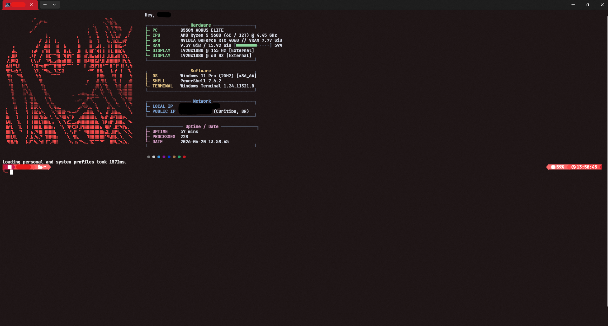
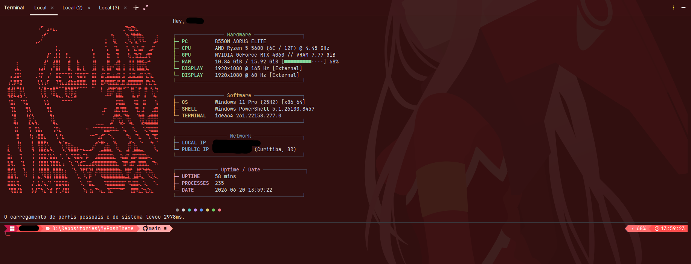

<div align="center">

# 🌸 Zero Two Theme

An ultra-aesthetic, premium pink-and-red terminal theme for **Oh My Posh**, **Fastfetch**, and **Windows Terminal**, inspired by Zero Two (*Darling in the Franxx*).

*Um tema de terminal premium e ultra-estético em tons de rosa e vermelho para o **Oh My Posh**, **Fastfetch** e **Windows Terminal**, inspirado na Zero Two (Darling in the Franxx).*

[](https://ohmyposh.dev/)
[](https://github.com/fastfetch-cli/fastfetch)
[](#)

</div>

---

## 📖 What is this? / O que é isso?

### English
This theme is a high-performance, visually striking terminal configuration custom-tailored to the color palette of Zero Two. It features structured powerlines, dynamic context indicators, advanced real-time system monitoring, and a fully customized Fastfetch layout with custom ASCII art.

### Português
*Este tema é uma configuração de terminal de alta performance e visual marcante, personalizada sob medida com a paleta de cores da Zero Two. Possui powerlines estruturados, indicadores de contexto dinâmicos, monitoramento avançado do sistema em tempo real e um layout do Fastfetch totalmente personalizado com arte ASCII exclusiva.*

---

## ✨ Features / Funcionalidades

### 🌸 Left Prompt (Prompt Esquerdo)
- **Session Details:** Displays OS type, system user, and hostname clearly. *(Detalhes da Sessão: Exibe o tipo de OS, usuário e hostname de forma clara.)*
- **Smart Directory Path:** Contextually shortens path names to show at most 3 parent folders for clean spacing. *(Caminho Inteligente: Encurta o caminho de diretórios para mostrar no máximo 3 pastas pai.)*
- **Comprehensive Git Integration:** Renders active branch, commits ahead/behind upstream, modified/staged/untracked file states, and stashed state. *(Integração Completa com Git: Renderiza branch ativa, commits à frente/atrás do upstream, estados de arquivos modificados/staged/não rastreados e stashes.)*
- **Environment Auto-Detection:** Automatically detects and shows icons for `Node.js`, `Java`, `Python`, `Go`, `Rust`, and `.NET`. *(Detecção de Ambientes: Detecta e exibe ícones de forma automática para Node.js, Java, Python, Go, Rust e .NET.)*

### ⚡ Right Prompt (Prompt Direito)
- **Resource Monitor:** Displays real-time RAM usage percentage. *(Monitor de Recursos: Exibe a porcentagem de uso de memória RAM em tempo real.)*
- **Execution Timer:** Shows the exact duration of the last executed command. *(Timer de Execução: Mostra a duração exata do último comando executado.)*
- **Real-Time Clock:** Displays current local time in `HH:MM:SS` format. *(Relógio em Tempo Real: Exibe o horário local atual no formato HH:MM:SS.)*

### ❯ Clean Input Line (Linha de Comando Limpa)
- The input cursor starts on a fresh line below the metadata block.
- Features an interactive arrow indicator (`❯`) that turns bright red when a command fails, providing instant visual feedback.
- *O cursor de digitação inicia em uma nova linha limpa abaixo dos blocos de metadados. Possui um indicador interativo (❯) que fica vermelho brilhante quando um comando falha, fornecendo feedback visual instantâneo.*

---

## 📸 Previews / Visualização

### Windows Terminal (PowerShell)


### IntelliJ IDEA Terminal (PowerShell)


---

## 🚀 Installation / Instalação

### English (Recommended)
This theme is part of a larger collection. The easiest and safest way to install it is using the automated installer at the root of this repository.

1. Navigate to the root directory of this project.
2. Run:
   ```powershell
   .\install.ps1
   ```
3. Enter `1` to select **Zero Two** from the interactive menu.
4. Restart your terminal or run `. $PROFILE`.

---

### Português (Recomendado)
*Este tema faz parte de uma coleção maior. A maneira mais fácil e segura de instalá-lo é usando o instalador automatizado na raiz deste repositório.*

1. *Navegue até a pasta raiz deste projeto.*
2. *Execute o comando:*
   ```powershell
   .\install.ps1
   ```
3. *Digite `1` para selecionar **Zero Two** no menu interativo.*
4. *Reinicie o seu terminal ou execute o comando `. $PROFILE`.*

---

## 🛠️ Manual Installation (Advanced) / Instalação Manual (Avançado)

If you prefer full control, you can apply files manually as follows:

| File / Arquivo | Target Location / Destino | Description / Descrição |
|:---|:---|:---|
| **`Zerotwo.omp.json`** | `~/.config/oh-my-posh/` | Oh My Posh configuration JSON. Load it in your `$PROFILE`. *(Configuração do Oh My Posh. Carregue no seu $PROFILE.)* |
| **`config.jsonc` & `ascii.txt`** | `~/.config/fastfetch/` | Fastfetch configuration and custom ASCII art. *(Configuração do Fastfetch e arte ASCII personalizada.)* |
| **`settings.json`** | Terminal LocalState Folder | Windows Terminal settings (color schemes and fonts). *(Configurações de cores e fontes do Windows Terminal.)* |
| **`Microsoft.PowerShell_profile.ps1`** | `$PROFILE` | Optional PowerShell profile helper commands. *(Script de ajuda opcional para o perfil do PowerShell.)* |

---

## 🔒 Security & Safe Pathing

This theme uses dynamic variables like `{{ .UserName }}` inside its prompt definitions instead of hardcoding username directories. This ensures that your local environment stays secure and shareable on Git.

*Este tema utiliza variáveis dinâmicas como `{{ .UserName }}` em suas definições de prompt em vez de fixar caminhos específicos de usuário. Isso garante que seu ambiente local permaneça seguro e compartilhável no Git.*
