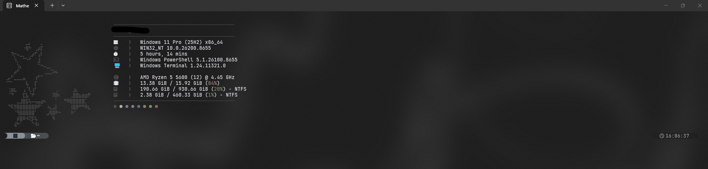
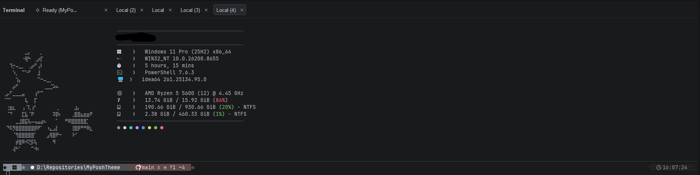

# CLEAN Stars Theme (Cinza Minimalista)

Tema cinza minimalista, elegante, focado em alta legibilidade sem excesso de poluição visual.

## 🌟 Características
- **Oh My Posh**: Prompt em duas linhas no estilo transient/floating pill com cantos arredondados, paleta em tons de cinza suaves (Chumbo/Grafite/Prata), informações cruciais (OS, Path, Git Status) e detecção dinâmica de runtimes de linguagens comuns (Node.js, Python, Rust, Go, .NET) de forma sutil.
- **Fastfetch**: Logo ASCII 3D minimalista customizado com degradê cinza e branco, listagem de informações com separadores de chevron cinza e ícones Nerd Fonts.
- **Windows Terminal**: Esquema de cores customizado `"Clean Stars"` pré-configurado, utilizando tons pastéis foscos e fundo carvão escuro translúcido com Acrylic.

---

## 📸 Previews / Visualização

### Windows Terminal (PowerShell)


### IntelliJ IDEA Terminal (PowerShell)


---

## 🛠️ Instalação

Para aplicar este tema, execute o instalador principal na raiz do repositório:

```powershell
.\install.ps1 -ThemeName cleanstars
```

Depois de instalado, reinicie o terminal ou execute:

```powershell
. $PROFILE
```

## 🎨 Paleta de Cores
- Fundo Terminal: `#1F1F1F` (Charcoal)
- Prompt OS Icon: Background `#8A9099` (Silver-Gray) | Foreground `#1F1F1F`
- Prompt Path: Background `#4A4D52` (Slate-Gray) | Foreground `#FFFFFF`
- Prompt Git Clean: Background `#6E747F` (Muted Steel) | Foreground `#1F1F1F`
- Prompt Git Dirty: Background `#5E4A4A` (Muted Deep Red-Gray) | Foreground `#FFD2D2` (Soft Pink)
