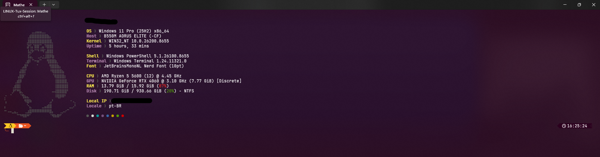
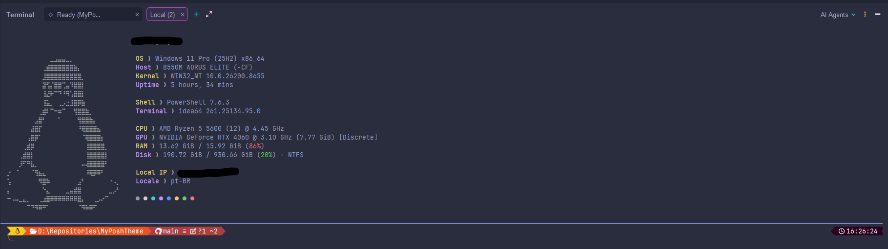

<div align="center">

# 🐧 Linux Theme

A highly polished, feature-rich terminal theme for **Oh My Posh**, **Fastfetch**, and **Windows Terminal**, inspired by the official Ubuntu terminal and Tux.

*Um tema de terminal altamente polido e rico em informações para o **Oh My Posh**, **Fastfetch** e **Windows Terminal**, inspirado no console oficial do Ubuntu e no Tux.*

[](https://ohmyposh.dev/)
[](https://github.com/fastfetch-cli/fastfetch)
[](#)

</div>

---

## 📖 What is this? / O que é isso?

### English
This theme is a highly detailed, power-user terminal configuration designed to replicate the classic, warm Ubuntu terminal ambiance. It features structured retro powerlines, dynamic context indicators, comprehensive system hardware telemetry, a custom Fastfetch configuration displaying 16 detailed modules, and a dedicated ASCII illustration of the legendary Tux penguin.

### Português
*Este tema é uma configuração de terminal altamente detalhada e voltada para usuários avançados, projetada para recriar o visual clássico e acolhedor do terminal Ubuntu. Possui powerlines estruturados retrô, indicadores de contexto dinâmicos, telemetria detalhada de hardware, layout do Fastfetch expandido com 16 módulos de informação e uma ilustração ASCII dedicada do lendário pinguim Tux.*

---

## ✨ Features / Funcionalidades

### 🐧 Left Prompt (Prompt Esquerdo)
- **Tux Icon Badge:** Renders a clean Tux Penguin icon (`🐧`) inside a vibrant golden-yellow segment to start the prompt. *(Selo de Ícone do Tux: Renderiza um ícone do Tux Penguin em um segmento dourado vibrante.)*
- **Ubuntu Orange Path:** Displays the current active directory with perfect contrast on an official Ubuntu Orange background. *(Caminho Laranja Ubuntu: Exibe o diretório atual com alto contraste sob o fundo laranja oficial do Ubuntu.)*
- **Aubergine Git Integration:** Shows Git branch and status on the official dark aubergine Canonical background. *(Integração Git Berinjela: Exibe branch e status Git sob a paleta berinjela escura oficial da Canonical.)*
- **Dynamic Runtimes:** Auto-detects and renders environment details for `Node.js`, `Python`, `Go`, `Rust`, and `.NET` as you navigate into project directories. *(Runtimes Dinâmicos: Detecta e exibe detalhes de ambientes de forma automática ao navegar em diretórios de projetos.)*

### ⚡ Right Prompt (Prompt Direito)
- **Execution Timer:** Displays the precise duration of the last executed command in Tux yellow. *(Timer de Execução: Exibe a duração precisa do último comando executado em amarelo Tux.)*
- **Real-Time Clock:** Shows the current local time in `HH:MM:SS` format on a dark aubergine segment. *(Relógio em Tempo Real: Exibe o horário local atual no formato HH:MM:SS sob um segmento berinjela escuro.)*

### ╰─ Clean Input Line (Linha de Comando Limpa)
- The typing cursor begins on a clean new line preceded by an Ubuntu Orange connection pipe (`╰─`).
- Features a classic yellow arrow cursor (`❯`) that turns bright red when a command fails.
- *O cursor de digitação inicia em uma nova linha limpa precedido por uma linha de conexão laranja Ubuntu (╰─). Possui o clássico cursor em formato de seta amarela (❯) que fica vermelho brilhante em caso de falha.*

---

## 📸 Previews / Visualização

### Windows Terminal (PowerShell)


### IntelliJ IDEA Terminal (PowerShell)


---

## 🚀 Installation / Instalação

### English (Recommended)
This theme is part of a larger collection. The easiest and safest way to install it is using the automated installer at the root of this repository.

1. Navigate to the root directory of this project.
2. Run:
   ```powershell
   .\install.ps1
   ```
3. Enter `2` to select **Linux** from the interactive menu.
4. Restart your terminal or run `. $PROFILE`.

---

### Português (Recomendado)
*Este tema faz parte de uma coleção maior. A maneira mais fácil e segura de instalá-lo é usando o instalador automatizado na raiz deste repositório.*

1. *Navegue até a pasta raiz deste projeto.*
2. *Execute o comando:*
   ```powershell
   .\install.ps1
   ```
3. *Digite `2` para selecionar **Linux** no menu interativo.*
4. *Reinicie o seu terminal ou execute o comando `. $PROFILE`.*

---

## 🛠️ Manual Installation (Advanced) / Instalação Manual (Avançado)

If you prefer full control, you can apply files manually as follows:

| File / Arquivo | Target Location / Destino | Description / Descrição |
|:---|:---|:---|
| **`Linux.omp.json`** | `~/.config/oh-my-posh/` | Oh My Posh configuration JSON. Load it in your `$PROFILE`. *(Configuração do Oh My Posh. Carregue no seu $PROFILE.)* |
| **`config.jsonc` & `ascii.txt`** | `~/.config/fastfetch/` | Fastfetch configuration and custom ASCII art. *(Configuração do Fastfetch e arte ASCII personalizada.)* |
| **`settings.json`** | Terminal LocalState Folder | Windows Terminal settings (color schemes and fonts). *(Configurações de cores e fontes do Windows Terminal.)* |
| **`Microsoft.PowerShell_profile.ps1`** | `$PROFILE` | Optional PowerShell profile helper commands. *(Script de ajuda opcional para o perfil do PowerShell.)* |

---

## 🔒 Security & Safe Pathing

This theme uses dynamic variables like `{{ .UserName }}` inside its prompt definitions instead of hardcoding username directories. This ensures that your local environment stays secure and shareable on Git.

*Este tema utiliza variáveis dinâmicas como `{{ .UserName }}` em suas definições de prompt em vez de fixar caminhos específicos de usuário. Isso garante que seu ambiente local permaneça seguro e compartilhável no Git.*
